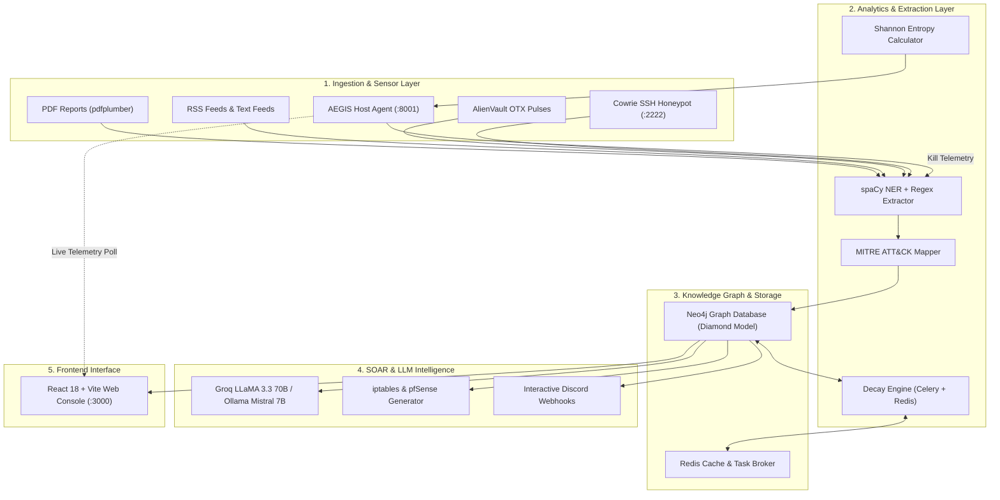

# ⚡ SPECTER x AEGIS

<div align="center">

### **Active Graph-Based Cyber Threat Intelligence (CTI), SOAR, and Real-Time Endpoint Ransomware Interception Platform**

[](https://www.python.org/)
[](https://fastapi.tiangolo.com/)
[](https://react.dev/)
[](https://neo4j.com/)
[](https://www.docker.com/)
[](LICENSE)

[Architecture](#-architecture) •
[Core Components](#-core-components) •
[Quick Start](#-quick-start) •
[Multi-Machine Setup (AEGIS on Remote Host / VM)](#-multi-machine-setup-aegis-on-different-machine) •
[API Reference](#-api-reference) •
[Research & Testing](#-research--empirical-validation)

</div>

---

## 📌 Executive Summary

Modern Security Operations Centers (SOCs) face two critical challenges:
1. **Threat Intelligence Overload & Stale IOCs**: Traditional threat feeds ingest thousands of indicators of compromise (IOCs) without contextual graph relationships or confidence degradation over time, leading to alert fatigue and obsolete blocklists.
2. **Catastrophic Ransomware Speed**: Signature-based endpoint detection mechanisms fail against novel or packed ransomware variants that encrypt entire file systems in seconds before signatures are updated.

**SPECTER x AEGIS** is a dual-engine cybersecurity platform built to solve both challenges:
- **SPECTER (Central Intelligence & SOAR Platform)**: Automatically ingests structured and unstructured CTI reports (PDFs, RSS, AlienVault OTX, Cowrie honeypots), maps TTPs to the **MITRE ATT&CK** framework, correlates entities inside a **Neo4j Diamond Model** knowledge graph, decays stale indicators using a mathematical **half-life algorithm** powered by Celery + Redis, dispatches interactive Discord/Slack alerts with Explainable AI (XAI), and auto-generates firewall mitigation scripts.
- **AEGIS (Endpoint Interceptor & Forensics Agent)**: A lightweight, cross-platform host defense agent that monitors filesystem telemetry in real time. It calculates **Shannon entropy** per write, monitors **write velocity**, intercepts **Volume Shadow Copy (VSS)** deletion, triggers an immediate **process kill switch (<850ms)**, captures in-memory/process tree forensics, and streams the kill telemetry back into SPECTER.

---

## 🏛️ Architecture



---

## 🔬 Core Components

### 1. SPECTER — Cyber Threat Intelligence & SOAR
* **Unstructured & Structured Ingestion**: Extracts IPv4, IPv6, MD5, SHA256, domains, URLs, CVEs, and email addresses from raw text, Mandiant/CISA PDF bulletins, AlienVault OTX pulses, and Cowrie honeypots.
* **Diamond Model Threat Graph**: Formulates knowledge relationships between `IOC`, `TTP`, `Actor`, and `Campaign` nodes within Neo4j. Automatically links extracted techniques directly to ATT&CK tactics.
* **IOC Confidence Half-Life Decay**: Real-time Celery beat tasks apply exponential decay to indicator confidence scores ($S(t) = S_0 \cdot (1 - \lambda)^t$), automatically archiving stale threats when they fall below a designated threshold (default: 30).
* **SOAR Automation**: Auto-generates ready-to-deploy Linux `iptables` scripts and `pfSense` XML firewall alias tables for active mitigation.
* **Explainable AI (XAI)**: Leverages Groq (LLaMA 3.3 70B) or local Ollama (Mistral 7B) to produce executive threat summaries, TTP campaign narratives, and transparent justification for why an IOC received its risk score.
* **Cowrie Honeypot Sidecar**: Captures unauthorized SSH brute-force attempts on port 2222; attacker IPs are auto-ingested with a confidence score of 100 in real time.

### 2. AEGIS — Ransomware Behavioral Interceptor
* **Zero-Day Behavioral Detection**: Evaluates processes based on what they *do*, rather than signature hashes.
* **Multi-Signal Behavioral Scoring (0–100)**:
  $$\text{Score} = \min(100, S_{\text{entropy}} + S_{\text{velocity}} + S_{\text{vss}} + S_{\text{extension}} + S_{\text{process}})$$
  - **Shannon Entropy Analysis**: Evaluates byte-level randomness per write ($>7.0 \text{ bits/byte}$ indicates encryption).
  - **Sliding-Window Velocity**: Detects rapid file modifications ($>15 \text{ files/sec}$).
  - **Shadow Copy Protection**: Monitors process trees for commands attempting to delete volume shadow copies (`vssadmin delete shadows`, `wbadmin`, `wmic`).
  - **Extension Churn**: Detects mass file renames with known and anomalous ransomware extensions (`.wncry`, `.lockbit`, etc.).
* **Sub-Second Process Tree Suspension**: Automatically suspends the parent and child processes of the offender before mass damage occurs.
* **Automated Evidence Bundle**: Gathers memory region mappings (RWX anonymous memory), process trees, network sockets, candidate C2 IPs, and ransom notes into a JSON artifact report.
* **SPECTER Telemetry Bridge**: Transmits the incident payload directly to SPECTER to correlate new TTPs and blacklist C2 addresses across the entire enterprise.

---

## 🚀 Quick Start

### Prerequisites
- [Docker](https://www.docker.com/) & Docker Compose
- [Node.js](https://nodejs.org/) (v18+)
- [Python](https://www.python.org/) (v3.10+)

### 1. Clone & Environment Setup
```bash
git clone https://github.com/<your-username>/specter-aegis.git
cd specter-aegis

# Copy environment template
cp .env.example .env
```
Open `.env` and configure your API keys (e.g., `GROQ_API_KEY`, `VIRUSTOTAL_API_KEY`, `SHODAN_API_KEY`, etc.).

### 2. Launch Core Services with Docker
```bash
docker-compose up -d
```
This spins up:
- **Neo4j** on `http://localhost:7474` (Bolt: `bolt://localhost:7687`)
- **Redis** on `localhost:6379`
- **SPECTER FastAPI Backend** on `http://localhost:8000`
- **Celery Worker & Beat Scheduler** (Decay Engine)
- **Cowrie Honeypot** on port `2222` (SSH) and `2223` (Telnet)
- **Cowrie Log Watcher Sidecar**

### 3. Launch Frontend Web Console
```bash
cd frontend
npm install
npm run dev
```
Access the dashboard at **`http://localhost:3000`**.

---

## 🌐 Multi-Machine Setup: AEGIS on Different Machine

AEGIS is designed to run directly on endpoints (such as an employee workstation, a Linux file server, or an isolated Windows analysis VM) while reporting back to the central SPECTER server over the network.

```
┌───────────────────────────────────────┐             ┌────────────────────────────────────────┐
│      SPECTER SERVER (Host/Cloud)      │             │    AEGIS ENDPOINT (VM / Remote Host)   │
│                                       │    HTTP     │                                        │
│  FastAPI Backend (Port :8000)         │ ◄────────── │  aegis.py                              │
│  React Dashboard (Port :3000)         │  Telemetry  │  Score API (Port :8001)                │
└───────────────────────────────────────┘             └────────────────────────────────────────┘
```

### Scenario A: Running AEGIS in an Isolated Windows VM (Malware Lab)
1. **VM Provisioning**: Set up a Windows 10/11 VM (VirtualBox / VMware).
2. **Network Isolation**:
   - Set the VM network adapter to **Host-Only**.
   - Verify that internet connectivity is disabled inside the VM (`ping 8.8.8.8` must fail).
   - Take a clean VM snapshot named `CLEAN_BASELINE`.
3. **Verify Connectivity to SPECTER**:
   - Locate the host machine's Host-Only adapter IP (e.g. `192.168.56.1`).
   - Test connectivity from the VM terminal:
     ```cmd
     curl http://192.168.56.1:8000/health
     # Returns: {"status":"ok","version":"7.0.0"}
     ```
4. **Run AEGIS**:
   ```powershell
   pip install -r backend/aegis/requirements.txt
   python aegis.py --watch "C:\Users\victim\Documents" --threshold 65 --specter-url http://192.168.56.1:8000 --demo
   ```

### Scenario B: Running AEGIS on a Remote Linux Machine / Server
```bash
# On the remote machine:
git clone https://github.com/<your-username>/specter-aegis.git
cd specter-aegis

python3 -m venv venv
source venv/bin/activate
pip install -r backend/aegis/requirements.txt

# Run with root privileges to prevent malware from killing AEGIS
sudo ./venv/bin/python aegis.py \
    --watch /home/data \
    --threshold 65 \
    --specter-url http://<SPECTER_SERVER_IP>:8000 \
    --demo
```

### Connecting the Web Dashboard to the Remote Agent:
1. Open the SPECTER web dashboard at `http://localhost:3000`.
2. Navigate to the **AEGIS** tab.
3. In the upper-right header, click the **Host** badge and enter your remote machine's IP (e.g., `http://192.168.56.10:8001`).
4. The status turns to **AEGIS ONLINE**, streaming real-time entropy metrics and interception telemetry across machines.

---

## 🛠️ CLI Options for AEGIS

```text
usage: aegis.py [-h] [--watch WATCH] [--threshold THRESHOLD]
                [--specter-url SPECTER_URL] [--demo] [--test] [--no-api]

options:
  --watch WATCH             Directory to monitor (default: C:\Users or ~)
  --threshold THRESHOLD     Kill threshold 0-100 (default: 65)
  --specter-url SPECTER_URL SPECTER API endpoint (default: http://localhost:8000)
  --demo                    Demo mode: displays live terminal score bar
  --test                    Runs safe synthetic ransomware simulator
  --no-api                  Disables local score API server on port 8001
```

---

## 📡 API Reference

### Core Ingestion & Threat Graph
| Method | Endpoint | Description |
|---|---|---|
| `GET` | `/health` | Service health status check |
| `GET` | `/api/stats` | Global dashboard statistics (IOC counts, critical count) |
| `POST` | `/api/ingest/pdf` | Upload and analyze a PDF threat report (Mandiant, CISA, etc.) |
| `POST` | `/api/ingest/text` | Ingest raw unstructured text or security alerts |
| `POST` | `/api/ingest/otx` | Pull latest threat pulses from AlienVault OTX |
| `POST` | `/api/ingest/rss` | Ingest security news and vulnerability RSS feeds |
| `GET` | `/api/iocs` | List active, non-archived IOCs |
| `GET` | `/api/iocs/critical` | Filter critical IOCs with confidence score $\ge 80$ |
| `GET` | `/api/iocs/search?q={query}` | Search IOC values across the graph |
| `GET` | `/api/iocs/{value}/neighborhood` | Graph traversal & entity relationship expansion |
| `GET` | `/api/graph` | Full graph data formatted for Canvas/D3 visualization |

### Enrichment & SOAR
| Method | Endpoint | Description |
|---|---|---|
| `GET` | `/api/enrich/virustotal/{ioc}` | Live VirusTotal v3 detection stats and reputation |
| `GET` | `/api/enrich/shodan/{ip}` | Shodan geolocation, ISP, and open port intelligence |
| `GET` | `/api/enrich/cve?ttp_ids={ids}` | Correlate MITRE TTPs to known exploited CVEs |
| `POST` | `/api/soar/firewall` | Generate `iptables` shell script or `pfSense` XML aliases |
| `POST` | `/api/soar/alert/{ioc}` | Manually trigger a high-priority SOAR webhook alert |

### LLM Intelligence Layer
| Method | Endpoint | Description |
|---|---|---|
| `POST` | `/api/llm/brief` | Generates an executive brief using Groq / Ollama |
| `GET` | `/api/llm/explain/{ioc}` | Explainable AI (XAI) breakdown of risk score factors |
| `POST` | `/api/llm/narrative` | Synthesizes MITRE TTPs into a cohesive attack campaign story |

---

## 📊 Research & Empirical Validation

AEGIS includes evaluation utilities for academic and security benchmarking:

```bash
# Generate ROC curves, detection latency metrics, and confusion matrix tables
python research/results_generator.py --mode all
```

Outputs:
- **ROC Curve (`roc_curve.png`)**: Measures True Positive Rate (TPR) vs False Positive Rate (FPR) across sensitivity thresholds.
- **Latency Benchmarks**: Validates mean detection latency ($<850\text{ms}$) across synthetic and real-world encryption patterns.
- **False Positive Resistance**: Evaluates legitimate high-entropy operations (7-Zip, compression utilities, video encoding) to ensure negligible false alarm rates.

---

## 🔒 Security Best Practices & Repository Safety

- **No Secrets in Version Control**: All API tokens, webhook URLs, and private keys must be stored strictly in `.env`. The provided `.gitignore` automatically prevents `.env`, Python virtual environments (`venv/`), Node modules (`node_modules/`), and forensic dumps (`evidence/`) from ever being committed.
- **Malware Handling**: Live ransomware experiments must strictly be performed in an offline, Host-Only virtualized sandbox.

---

## 📝 License

Distributed under the **MIT License**. See `LICENSE` for details.
